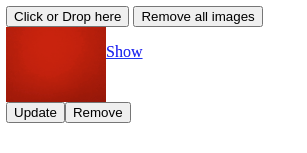

# React next.js with Redux Image Uploader on MongoDB




It also displays images saved as Buffered.

### Display Buffered Image with Express.js

to display with express.js [in the file](./server.js)

```JavaScript
    controllers.mongodb.get(id)
        .then(result=>{
            res.writeHead(200, {
                'Content-Type': result.type,
                'Content-Length': result.data.length
              });
              res.end(result.data); 
```

### Save base64 Image as Buffer on MongoDB

- Convert base64 to Uint8Array in [the file](controllers/mongodb.js)

```JavaScript
const buffArray = Buffer.from(_base64Data, "base64");
```

- Conver Uint8Array to Buffer

converter in (utils)(helpers/utils.js):

```JavaScript
const toBuffer = (ab) => {
    const buf = Buffer.alloc(ab.byteLength);
    const view = new Uint8Array(ab);
    for (let i = 0; i < buf.length; ++i) {
        buf[i] = view[i];
    }
    return buf;
}
```

#### MongoDB Model for Image Buffer Type

```JavaScript
const imageSchema = mongoose.Schema(
  {
    name: {
      type: String,
      required: true,
    },
    type: {
      type: String,
      required: true,
    },
    data: {
      type: Buffer,
      required: true,
    }
  }
);
```

## Install

`cd frontend && npm i && yarn export && mv out/ ../. && cd .. && npm i && npm start`

[http://localhost:8080]("http://localhost:8080")

Note: Please create and set .env file up like .env-example
